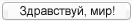
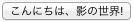

# Теневая модель документа (Shadow DOM)

## Введение

Веб-компоненты — это набор новых стандартов, которые:

1. Позволяют создавать виджеты
2. … которые могут быть использованы повторно без риска сбоев
3. … и которые не приводят к разрушению страницы если в следующей версии
соответствующего веб-компонента внесены изменения в детали реализации.

Значит ли это что придётся определиться где стоит использовать HTML/JavaScript,
а где — веб-компоненты? Нет! С помощью HTML и JavaScript можно создавать разные
визуальные интерактивные штуки. В том числе и виджеты. При разработке виджета
целесообразно воспользоваться знаниями HTML и JavaScript. Веб-компоненты
придуманы чтобы вам в этом помочь.

> Не вижу смысла в переключении на другую технологию при разработке виджета.
Например, я крайне не приветствую разработку виджетов на основе `<canvas>`. Этот
элемент надёжен (если вы измените то, что он отрисовывает, странице не будет
нанесён вред), однако он несовместим с доступностью, индексацией, композицией и
независимостью от разрешения.

Тем не менее, есть существенная проблема из-за которой разрабатывать виджеты на
HTML и JavaScript довольно сложно: дерево элементов виджета не инкапсулировано
от остальной страницы. Отсутствие инкапсуляции значит, что таблица стилей вашего
сайта может быть по ошибке применена к компонентам внутри виджета; ваш
JavaScript может случайно изменить составляющие виджета; названия ваших
идентификаторов могут оказаться идентичными названиям идентификаторов внутри
виджета и так далее.

> Наиболее вредоносным обстоятельством отсутствия инкапсуляции является то, что
после модернизации библиотеки и изменений в дереве элементов внутри виджета,
стили и скрипты вашей страницы могут быть разрушены самым непредсказуемым
образом.

Веб-компоненты состоят из четырёх частей:

1. [Шаблоны (Templates)][1]
2. [Теневая модель документа (Shadow DOM)][2]
3. [Настраиваемые элементы (Custom Elements)][3]
4. [Пакетирование (Packaging)][4]

**Теневая модель документа** направлена на решение проблемы инкапсуляции дерева
элементов. Четыре части веб-компонентов были придуманы для того, чтобы
использоваться вместе, однако их можно использовать и отдельно. В этом
руководстве вы узнаете как использовать теневую модель документа (Shadow DOM).

Спецификация теневой модели документа пока поддерживается только в Chrome 25,
поэтому для этого API используется вендорный префикс webkit.

## Здравствуй, мир теней

В спецификации теневой модели документа вводится новый тип элементов. Он
называется **корневым элементом теневого дерева** (shadow root). Элемент, к
которому привязан корневой элемент теневого дерева, называется **ведущим
элементом теневого дерева** (shadow host). Содержимое ведущего элемента не
отображается, вместо него отображается содержимое корневого элемента теневого
дерева.

Например, если у вас такая разметка:

    <button>Здравствуй, мир!</button>
    

то вместо

<button id="ex1a">Привет, мир!</button>

на вашей странице будет отображено

<button id="ex1b">Привет, мир!</button>

Это ещё не всё, если JavaScript страницы запросит `textContent` кнопки, ответом
будет не «こんにちは、影の世界!», а «Здравствуй, мир!», потому что дочернее дерево
инкапсулировано.

Пожалуй, здесь нарушено одно золотое правило: в теневое дерево нельзя помещать
*контент*. Он должен быть помещён в основное дерево страницы, чтобы быть
доступным скринридерам, поисковым системам и т.д. Теневое дерево предназначено
для всей той семантически бессмысленной разметки, которая нужна, чтобы создать
красивый и удобный виджет. А вот контент должен оставаться в коде страницы.

> Конечно же, за нарушение этого правила вас никто не осудит; в сети вы свободны
делать более-менее всё, что вам угодно. Однако, не перегибайте палку.

## Разделение контента и представления

Теперь мы посмотрим как, используя теневую модель документа, можно разделить
контент и представление. Скажем, у нас есть вот такая именная табличка:

  

    Hi! My name is
  

  

    Bob
  

Вот разметка. Такую вы бы написали сейчас. В ней не используется теневая модель
документа.

    
    

      

        Здравствуйте! Меня зовут
      

      

        Сергей
      

    

Так как дерево элементов не инкапсулировано, всё содержимое именной таблички
помещено прямо в код страницы. Если волей случая для каких-либо элементов в
остальном коде страницы используются те же имена классов для стилизации или
подключения скрипта, нам придётся не сладко.

Этого можно избежать.

### Шаг 1. Прячем описание представления

С точки зрения семантики нам нужны только следующие сведения:

* Перед нами именная табличка.
* На табличке имя «Сергей».

Сначала напишем разметку с учётом наших семантических требований:

    
Сергей

Затем поместим все теги `div` и описание стилей, отвечающих за представление, в
элемент `<template>`:

    
Сергей

    <template id="nameTagTemplate">
    
    

      

        Здравствуйте! Меня зовут
      

      

        Сергей
      

    

    </template>

На данном этапе отображается только «Сергей». Так как мы поместили элементы,
отвечающие за представление, в элемент `<template>`, они не отображаются, однако
их *можно* извлечь с помощью JavaScript. Что мы сейчас и сделаем, чтобы
заполнить корневой элемент теневого дерева:

    

> Стандарты для создания шаблонов, вроде теневой модели документа, находятся на
стадии становления. Элемент `<template>` поддерживается в Chrome Canary.
Корневой элемент теневого дерева можно заполнить также с помощью таких хорошо
известных свойств и методов как `innerHTML`, `appendChild`, `getElementById` и
т.д. Эта статья посвящена теневой модели документа, так что мы не будем вникать
в работу элемента `<template>` глубже. Если вы хотите узнать о нём больше,
прочитайте статью [«Новый HTML-тег `template`»][5].

Теперь, после прописания кода корневого элемента теневого дерева, именная
табличка снова отображается полностью. Если кликнуть по ней правой кнопкой мыши
и просмотреть код элемента, можно увидеть симпатичную семантическую разметку:

    
Сергей

Как видите, мы спрятали описание представления именной таблички используя
теневое дерево.

### Шаг 2. Разделение контента и представления

В коде страницы теперь не видно описания представления именной таблички, однако
нельзя говорить о разделении представления и контента. Ведь хоть на странице и
присутствует контент (имя «Сергей»), однако на самом деле отображается имя,
скопированное в корневой элемент теневого дерева. Чтобы изменить имя на табличке,
его нужно поменять в двух местах, что в результате может привести к
непоследовательности.

Элементы HTML композиционны — например, можно поместить кнопку в таблицу.
Композиционность именно то, что нам в этом случае нужно: именная табличка должна
быть композицией из красного фона, текста приветствия и имени на табличке.

Вы, создатель компонента, определяете какая композиция должна быть у вашего
виджета, используя новый элемент `<content>`. Он создаёт точку вставки в
представлении виджета, в которой выборочно отображается контент из ведущего
элемента теневого дерева.

Изменим разметку теневого дерева на следующую:

    <template id="nameTagTemplate">
    
    

      

        Здравствуйте! Меня зовут
      

      

        <content></content>
      

    

    </template>

При отображении именной таблички, содержимое из ведущего элемента проецируется в
то место, где находится элемент `<content>`.

Теперь структура страницы упрощена, ведь имя указано только в одном месте — в
коде страницы. Если вам когда-нибудь потребуется обновить имя пользователя,
нужно только прописать:

    document.querySelector('#nameTag').textContent = 'Игорь';

и всё. Отображение именной таблички автоматически обновляется браузером, потому
что происходит **проецирование** её содержимого туда, где расположен `<content>`.

Пример использования Shadow DOM:

Иван

<label for="ex2bNewName">Новое имя:</label>
<input name="ex2bNewName" value="Аня">
<button onclick="updateClicked('#ex2bNameTag', 'input[name=ex2bNewName]');">Обновить</button>

<template id="ex2bNameTagTemplate">

  

    Привет! Меня зовут
  

  

    <content></content>
  

</template>

Теперь мы добились разделения контента и представления. **Контент помещён в
дерево страницы; представление — в теневое дерево.** Когда приходит время
что-либо отобразить, браузер их синхронизирует автоматически.

### Шаг 3. Польза

Разделяя контент и представление можно упростить код, используемый для
управления контентом. В примере с именной табличкой в этом коде простая
конструкция с всего одним `
` вместо нескольких.

Если нам нужно изменить представление, код в дереве страницы менять не нужно!

Например, представим что нам нужно локализировать именную табличку. Мы имеем
дело с той же самой именной табличкой, так что семантическое содержимое страницы
не меняется:

    
Сергей

Исходный код в корневом элементе теневого дерева остаётся прежним. Изменяется
только то, что в него подставляется:

    <template id="nameTagTemplate">
    
    

      

        <content></content>
      

      と申します。
    

    </template>

Теперь мы получили именную табличку с текстом на японском языке:

![Именная табличка с акварельным рисунком цветущей вишни][вишня]

[Автор фонового изображения — Майк Дауман (Mike Dowman)][6]; изображение
использовано в согласии с условиями лицензии Creative Commons.

Это значительный шаг вперёд, ведь код для обновления имени зависит от структуры
соответствующего *компонента*, которая теперь проста и последовательна. **Ваш
код для обновления имени не должен учитывать элементы, которые используются для
отображения контента.** Если взглянуть на то, что отображается, в русском языке
имя идёт на втором месте (после «Здравствуйте! Меня зовут»), но первым в
японском (перед «と申します»). Это различие не имеет никакого семантического
значения на этапе обновления отображаемого имени, так что не должно быть
необходимости учитывать этот нюанс в коде обновления имени.

## Бонус: продвинутое проецирование

В примере выше элемент `<content>` выбирает контент из ведущего элемента
теневого дерева. Используя атрибут `select` можно контролировать что проецирует
элемент `<content>`. Также можно использовать несколько элементов `<content>`.

Например, у нас есть такой код страницы:

    

      
Сергей

      
С. Максимов

      
serg@

    

и корневой элемент теневого дерева, который с помощью селекторов CSS проводит
выборку определённого контента:

    

      

        <content select=".first"></content>
      

      

        <content select="div"></content>
      

      

        <content select=".email"></content>
      

    

**Примечание:** с помощью `select` можно выбрать только те элементы, которые
являются непосредственно дочерними по отношению к главному узлу. Это значит что
нельзя выбрать непрямой потомок (например `select="table tr"`).

Элемент `
` подходит под условие `<content select="div">` и
`<content select=".email">`. Сколько раз будет отображаться электронный адрес
Сергея и в каком цвете?

![Результат, который будет отображаться. Электронный адрес Сергея выводится в
жёлтом цвете.][Сергей]

Ответ: электронный адрес Сергея выводится один раз, в желтом цвете.

Причиной этому то, что создание дерева для контента, который впоследствии будет
отображаться на экране, напоминает организацию большого праздника. **Элемент
`content` — это приглашение, которое впускает контент из кода страницы в
служебные помещения теневой модели документа для последующего отображения на
странице.** Эти приглашения доставляются по очереди; приглашение получает тот,
кто прописан как получатель (с помощью атрибута `select`). Контент получает
приглашение и отправляется на праздник. Если на тот же адрес отправлено ещё одно
приглашение, то оно никого не застаёт дома и никто больше не придёт на ваш
праздник.

В примере выше `
` подходит под условия наличия `div` и
`.email`, однако так как элемент `content` с селектором `div` в коде идёт первым,
`
` отправляется на на жёлтый праздник и на синий праздник
идти некому.

Если какой-то элемент не приглашён *ни на один* праздник, он не отображается
вовсе. Вот что случилось с текстом «Здравствуй, мир» в самом первом примере. Это
может пригодиться, когда нужно достичь кардинально отличающегося отображения:
пропишите семантическую модель в коде страницы, которая будет доступна скриптам,
но не будет отражаться, и с помощью JavaScript подключите её к абсолютно иной
модели отображения в теневом дереве.

Например, в HTML предложена прекрасная возможность выбора даты. Если прописать
`<input type="date">`, получите аккуратный всплывающий календарь. Но что если
нужно предоставить пользователю возможность выбрать диапазон дат для отпуска его
мечты? Код страницы нужно прописать так:

    

      <label for="start">Начало:</label>
      <input type="date" name="startDate" id="start">
       
      <label for="end">Конец:</label>
      <input type="date" name="endDate" id="end">
    

и создать теневое дерево, в которое будет помещена таблица для создания
первоклассного календаря с подсветкой диапазона дат и другими возможностями.
Когда пользователь кликает по дням в календаре, компонент обновляет состояние
полей ввода `startDate` и `endDate`; когда пользователь отсылает введённые
данные на обработку, отсылаются значения этих элементов `input`.

Зачем я добавил теги `label`, если они не будут отображаться? Если пользователь
будет просматривать форму в браузере, не поддерживающем теневую модель документа,
форма все равно будет работать, хоть и не будет выглядеть так же красиво.
Пользователь увидит нечто вроде:

  <label for="start">C:</label>
  <input type="date" name="startDate" id="start">
   
  <label for="end">По:</label>
  <input type="date" name="endDate" id="end">

## Конец первой части

Это всё основы теневой модели документа, вы успешно ознакомились с первой частью
цикла статей! С помощью теневой модели документа можно осуществить намного
большее, например, можно применить несколько теней для одного ведущего элемента
теневого дерева или вложенные тени для инкапсуляции или же построить свою
страницу на основе модельно-управляемых представлений (Model-Driven Views) и
теневой модели документа. И теневой моделью документа веб-компоненты не
ограничиваются. Например, используя ещё одну часть веб-компонентов, под
названием настраиваемые элементы, можно прописать теневое дерево для виджетов
декларативно вместо того, чтобы использовать для этого скрипты.

[1]: https://dvcs.w3.org/hg/webcomponents/raw-file/tip/spec/templates/index.html
[2]: http://www.w3.org/TR/shadow-dom/
[3]: https://dvcs.w3.org/hg/webcomponents/raw-file/tip/spec/custom/index.html
[4]: https://dvcs.w3.org/hg/webcomponents/raw-file/tip/explainer/index.html#external-custom-elements-and-decorators
[5]: http://www.html5rocks.com/en/tutorials/webcomponents/template/
[6]: http://www.flickr.com/photos/mikedowman/5621169045/

[Здравствуй]: img/SS1-ru.png
[японский]: img/SS2.png
[вишня]: img/SS4-ru.png
[Сергей]: img/SS5-ru.png